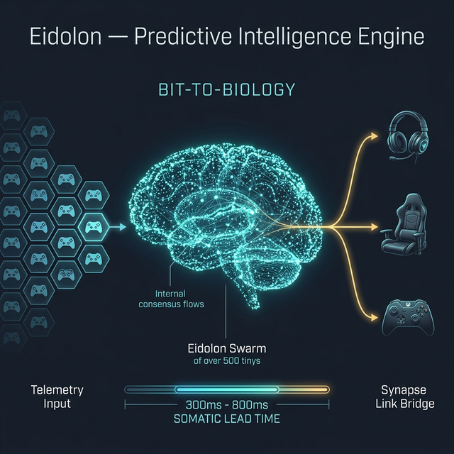

<p align="center">
  
</p>

<h1 align="center">EIDOLON</h1>
<h3 align="center">Predictive Intelligence Engine Concept</h3>

<p align="center">
  <strong>The Predictive Intelligence Layer for haptic gear — Giving gamers a pre-cognitive "Sixth Sense" through distributed swarm intelligence.</strong>
</p>

---

## 👁️ Overview

**Eidolon** is a smart AI layer designed to connect hidden game data directly to haptic gear like vests, headsets, and controllers. It tackles **"The Render-to-Reaction Lag"** — that split-second delay where your brain has to wait to see an event on screen before you can actually react to it. By predicting what is about to happen and letting you "feel" it through your skin before it appears visually, Eidolon gives your nervous system an instant head start.

Current somatic feedback in premium gaming hardware (like the **Sony DualSense**, **bHaptics TactSuit**, or **Razer HyperSense** headsets) acts as an immersive enhancement to normal gameplay, translating *present* sound and *present* in-game events into reactive vibration. While highly entertaining and visceral, this strictly reactive approach represents only a fraction of what true somatic intelligence can achieve. 

Instead of waiting for an event to happen, Eidolon's intelligent engine tries to predict the unfolding physics and gameplay mechanics. By deploying a **Distributed Swarm** of autonomous algorithms that simulate probable near-futures based on real-time collision, velocity, and state telemetry, Eidolon generates a proactive, intuitive "Somatic Lead Time." This transforms haptics from a reactive after-effect into a proactive "Sixth Sense."

> [!TIP]
> **📽️ See Eidolon in action:** Check out the [Visual Walkthrough & Demo Video](DEMO.md) to see the swarm engine predicting flanking maneuvers in real-time.

## 🔮 Vision

Our ultimate vision is to establish **"Bit-to-Biology"** processing as a universal standard in interactive media. We believe the future of high-skill gaming is about profound immersion and sensory expansion—feeding intuitive environmental awareness directly to the skin.

By predicting game-state transitions 300ms–800ms before they manifest visually, Eidolon "pre-warms" the player's nervous system. This enhances the player's natural skill ceiling, allowing for fluid, intuition-based gameplay where players seamlessly anticipate and flow with the physics of the game world.

> **We don't specialize in haptic fidelity. We specialize in *Somatic Intelligence*.**

---

## 🏗️ Architecture Concept

```text
┌────────────────────────────────────────────────────────────────────┐
│                    TELEMETRY-TO-SIGNAL PIPELINE                    │
├────────────────────────────────────────────────────────────────────┤
│                                                                    │
│  ┌──────────────┐     ┌───────────────────┐     ┌──────────────┐  │
│  │  Game Engine  │────▶│   EidolonSwarm     │────▶│  Intent      │  │
│  │  Telemetry    │     │   (AI Agents)      │     │  Router      │  │
│  │              │     │                   │     │              │  │
│  │  · Positions  │     │  · Consensus      │     │  · FLANK     │  │
│  │  · Velocities │     │  · Entropy        │     │  · AMMO      │  │
│  │  · Health     │     │  · Lead Time      │     │  · MORALE    │  │
│  │  · Ammo       │     │                   │     │  · VIBE      │  │
│  └──────┬───────┘     └───────────────────┘     └──────┬───────┘  │
│         │                                               │          │
│    ┌────▼────────────┐                 ┌────────────────┘          │
│    │ Real-Time Core   │                 ▼                          │
│    │ · <1ms Latency   │  ┌──────────────────────────────────────┐  │
│    │ · High Volume    │  │        SYNAPSE LINK BRIDGE           │  │
│    └─────────────────┘  │  ┌─────────────┐  ┌──────────────┐   │  │
│                          │  │ Ghost Layer  │─▶│ Hardware     │   │  │
│    ┌─────────────────┐  │  │ (Entropy     │  │ Tuning       │   │  │
│    │ Security         │  │  │  Filter)     │  │              │   │  │
│    │ · Isolation      │  │  │ E > 0.5 →    │  │ · HEADSET    │   │  │
│    └─────────────────┘  │  │ POSSIBILITY  │  │ · CUSHION    │   │  │
│                          │  │ + SHIMMER    │  │ · CONTROLLER │   │  │
│    ┌─────────────────┐  │  └─────────────┘  └──────┬───────┘   │  │
│    │ AI Processing    │  │                           │           │  │
│    │ · Inference      │  │  ┌────────────────────────▼────────┐  │  │
│    │ · Prediction     │  │  │ Pre-Cognitive Signal (Data)     │  │  │
│    └─────────────────┘  │  │ → intent, classification        │  │  │
│                         │  │ → consensus, entropy, lead_time │  │  │
│                         │  └─────────────────────────────────┘  │  │
│                         └──────────────────────────────────────┘  │
└────────────────────────────────────────────────────────────────────┘
```

---

## 🎮 Gaming Intent Modules

Eidolon processes raw telemetry to predict specific types of immersive concepts:

### 1. FLANK_DETECTION — Tactical Converging
Detects enemies converging from non-frontal directions. Alerts the player's nervous system **before** the threat appears in their field of view.

### 2. AMMO_PREDICTION — Pre-Empty-Click Sensing
Predicts ammunition depletion before the empty-click moment. Designed to create a growing "dread" sensation in the trigger hand through adaptive trigger stiffness.

### 3. MORALE_DROPS — Emergent Panic Detection
Detects collective squad morale collapse from aggregate health patterns and death frequency, translating abstract statistics into a physical "sinking" sensation.

### 4. VIBE_ANALYSIS — Crowd Sentiment Resonance
Senses the collective "vibe" of crowd or NPC populations. Detects when a room is turning hostile or excited before visual chaos erupts.

---

## ⚡ Quick Start & Workflow

To experience the Eidolon engine predicting intent from raw telemetry:

### 1. Start the Synapse Server
The engine exposes a Real-Time WebSocket and REST API to ingest telemetry:
```bash
python -m uvicorn src.server.synapse_server:app --host 0.0.0.0 --port 8080
```

### 2. The Execution Workflow
Once the server is running, the workflow follows a precise cycle:
1. **Ingest Game State**: The game engine sends raw, unannotated entity telemetry (positions, velocities, state) via WebSocket or HTTP.
2. **Swarm Evaluation**: The telemetry is pipelined through a distributed swarm of independent simulation agents.
3. **Intent Classification**: Based on the Swarm's consensus and entropy, an intent (e.g., `FLANK_DETECTION`) is proactively identified.
4. **Pre-Cognitive Signal Emission**: A semantic `PreCognitiveSignal` JSON object is instantly returned to the client, mapping the event to the appropriate somatic hardware zone (`VEST`, `HEADSET`, `CONTROLLER`) with an assigned intensity and predicted lead time.

### 3. Run the Local Demo
To quickly simulate a live gameplay scenario (e.g., an enemy sprinting towards the player's flank), you can run the provided demo script. The script automatically launches the server, sends the telemetry, and displays the engine's Pre-Cognitive Signal response:
```bash
python run_demo.py
```

This will instantly output the engine's cognitive assessment, identifying specific hardware targets and haptic intensities (like a `SHARP` warning signal to the `HEADSET` mapping the incoming flank) before shutting down securely.

### 4. Visual Documentation
For a deep dive into the HUD, swarm metrics, and a full video breakdown of the predictive pipeline, see:
👉 **[DEMO.md — Video Walkthrough & Technical Deep Dive](DEMO.md)**

---

## 🔬 Core Algorithms
The conceptual Eidolon engine relies on a suite of low-latency algorithms to predict intent:
- **Vector Converging Trajectory**: Detects imminent entity convergence by evaluating future distance states natively.
- **Consensus & Entropy Dynamics**: Aggregates massive agent swarms to derive system confidence and measure environmental chaos.
- **Somatic Lead Time**: Calculates the available pre-cognitive window based on relative velocity, enabling proactive hardware preparation.

---

<p align="center">
  <strong>Powered by Eidolon: Synapse</strong>
</p>
